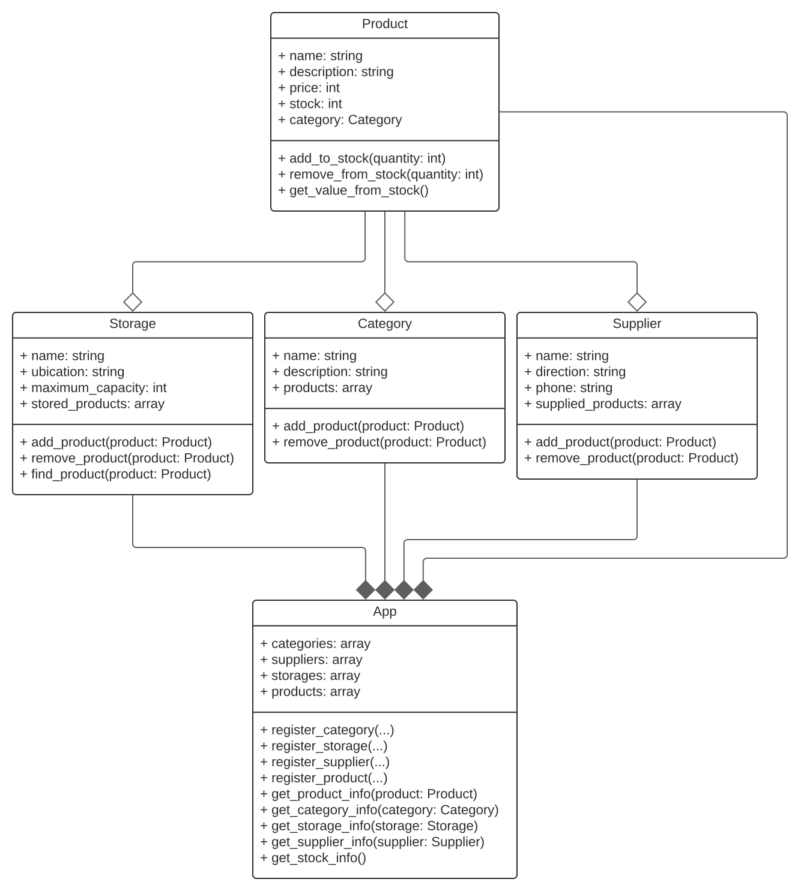

# Ejercicio #2
Trabajo #2 del curso Programación 1 para un programa de un sistema gestión de inventarios

## Instalación

```bash
python -m venv .venv
source .venv/Scripts/activate
pip install -r requirements.txt
python main.py
```

### Prerequisites

- Version de python instalada 3.12.5

## Diagrama de clase



## Autor
- [@siCasta](https://github.com/siCasta)
